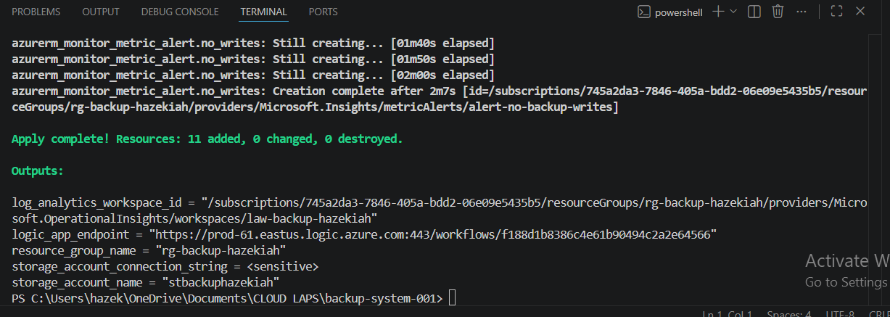
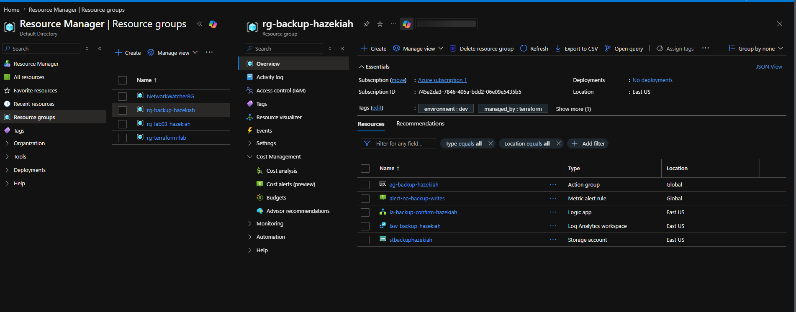
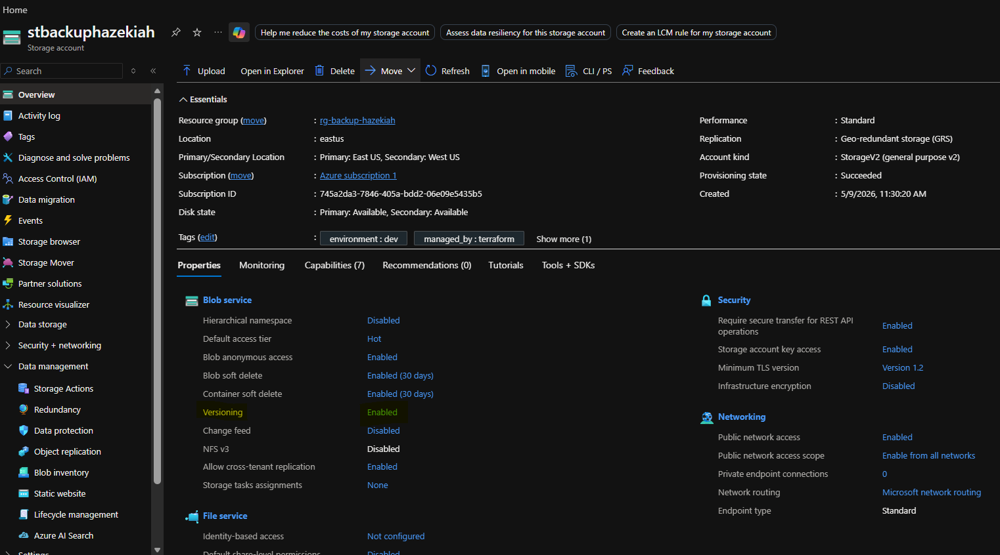
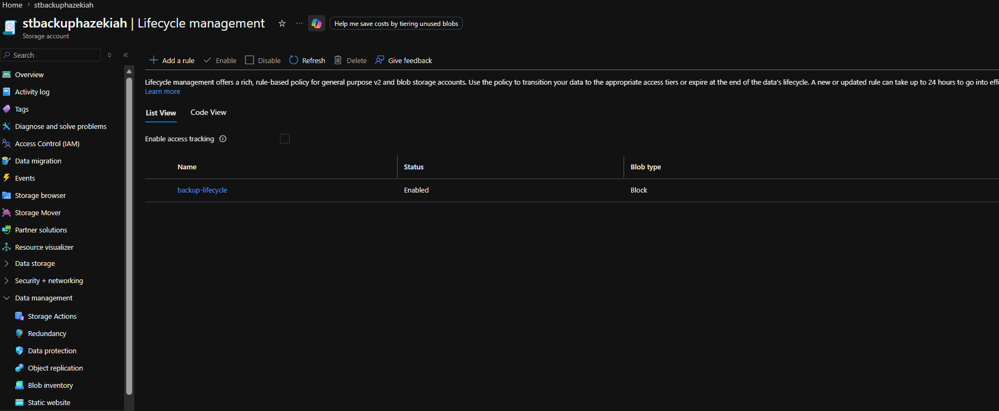
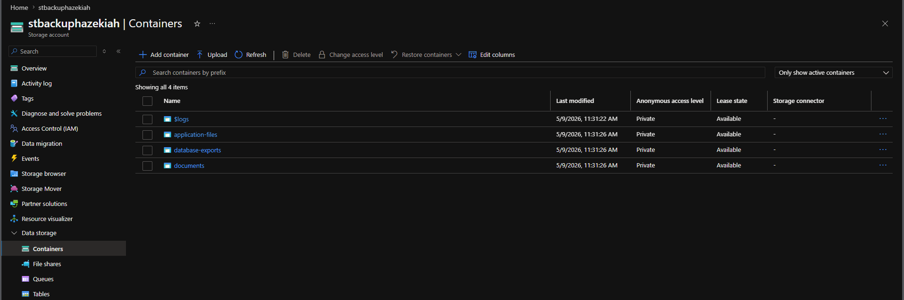
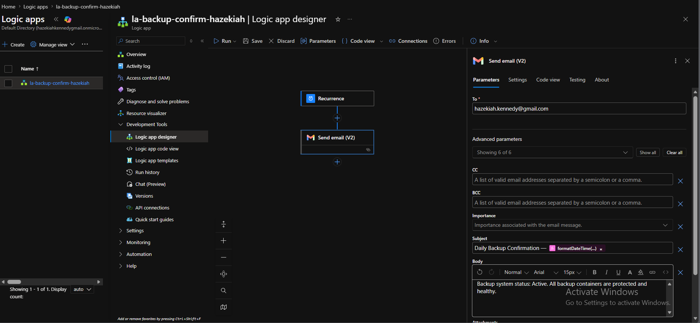
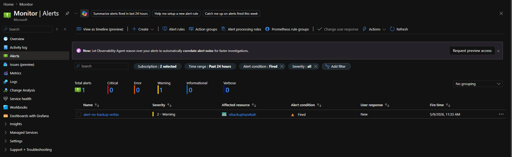
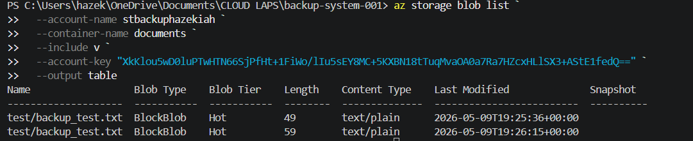
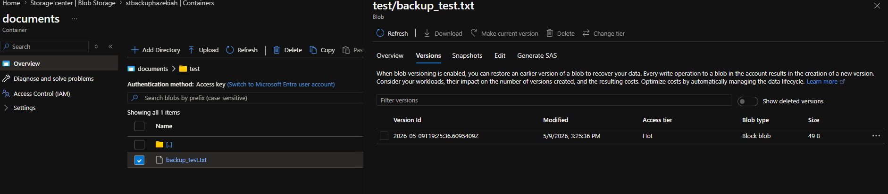

# Project 2 — Automated Backup System
*Azure Blob Storage · Lifecycle Management · Logic Apps · Azure Monitor · Terraform*

| Field | Value |
|---|---|
| Certification alignment | AZ-900 · AZ-104 · Azure Administrator |
| Tools used | Terraform · Azure CLI · Azure Blob Storage · Logic Apps · Azure Monitor · Log Analytics |
| Time to complete | 3–4 hours |
| Estimated cost | $0 — fully within Azure free tier |
| Career relevance | Cloud Engineer · DevOps Engineer · Cloud Administrator · Data Engineer |

---

## The Business Problem This Lab Solves

For most small businesses the backup strategy is someone occasionally copying files to an external drive. When that person is on holiday, busy, or just forgets — nothing gets backed up. When something goes wrong, and something always eventually goes wrong, the data is simply gone.

This project replaces that manual unreliable process with a system that:

- Automatically replicates every file across multiple Azure data centers the moment it is uploaded
- Keeps every previous version of every file so anything accidentally deleted or overwritten can be restored
- Automatically moves older files to cheaper storage tiers after 30 days and archives them after 90 days — keeping costs under control without manual intervention
- Sends a confirmation email every morning so the business owner knows the backup system is working without having to check
- Fires an alert if no files have been written in 24 hours — catching backup failures before the business owner notices

The business outcome: no more lost data, no more manual processes, no more hoping someone remembered.

---

## What Gets Built

| Resource | Name | Purpose |
|---|---|---|
| Resource Group | `rg-backup-hazekiah` | Container for all lab resources |
| Storage Account | `stbackuphazekiah` | Primary backup store with GRS replication and versioning |
| Container — documents | `documents` | Stores document backups |
| Container — database-exports | `database-exports` | Stores database backup files |
| Container — application-files | `application-files` | Stores application backup files |
| Lifecycle Policy | `backup-lifecycle` | Moves files to Cool at 30 days, Archive at 90 days, deletes at 365 days |
| Log Analytics Workspace | `law-backup-hazekiah` | Stores storage audit logs |
| Diagnostic Settings | `diag-storage-to-law` | Routes storage read/write/delete logs to Log Analytics |
| Action Group | `ag-backup-hazekiah` | Sends email when alert fires |
| Logic App | `la-backup-confirm-hazekiah` | Sends daily backup confirmation email at 8am |
| Monitor Alert | `alert-no-backup-writes` | Fires if no files written to storage in 24 hours |

---

## Prerequisites

Terraform and Azure CLI must be installed. Run these to verify:

```powershell
terraform --version
az --version
```

Log in to Azure:

```powershell
az login
az account set --subscription "Azure subscription 1"
az account show
```

---

## Folder Setup

```powershell
New-Item -ItemType Directory -Path "C:\Users\<yourname>\OneDrive\Documents\CLOUD LAPS\backup-system-001"
cd "C:\Users\<yourname>\OneDrive\Documents\CLOUD LAPS\backup-system-001"
```

---

## Step 1 — Deploy with Terraform

Place all 4 Terraform files in your project folder then run:

```powershell
terraform init
terraform plan
terraform apply -auto-approve
```

Expect **11 resources to add**. Deployment takes 2–3 minutes.



---

## Step 2 — Verify the Resource Group

Navigate to the resource group:

**Home → Resource groups → rg-backup-hazekiah**



---

## Step 3 — Verify the Storage Account and Versioning

Navigate to the storage account:

**Home → Storage accounts → stbackuphazekiah → Overview → Properties tab**

This page confirms:
- Replication: **Geo-redundant storage (GRS)** — data replicated across two Azure regions
- Versioning: **Enabled** — every file version is kept for recovery
- Blob soft delete: **Enabled (30 days)** — deleted files recoverable for 30 days
- Minimum TLS version: **Version 1.2** — secure connections enforced



---

## Step 4 — Verify the Lifecycle Policy

Navigate to lifecycle management:

**Home → Storage accounts → stbackuphazekiah → Data management → Lifecycle management**

You should see the `backup-lifecycle` rule configured with:
- Move to Cool tier after 30 days
- Move to Archive tier after 90 days
- Delete after 365 days
- Delete old versions after 30 days



---

## Step 5 — Verify the Storage Containers

Navigate to containers:

**Home → Storage accounts → stbackuphazekiah → Data storage → Containers**

You should see four containers — `$logs` (auto-created by Azure for diagnostics), `application-files`, `database-exports`, and `documents` — all with **Private** access.



---

## Step 6 — Configure the Daily Confirmation Logic App

Navigate to the Logic App designer:

**Home → Logic apps → la-backup-confirm-hazekiah → Development Tools → Logic app designer**

### Add the Recurrence trigger:
1. Click **Add a trigger**
2. Search for **Recurrence**
3. Select **Recurrence**
4. Set **Frequency** to **Day**
5. Set **Interval** to **1**
6. Set **At these hours** to **8** — runs at 8:00 AM daily

### Add the Gmail Send email action:
1. Click the **+** button below the Recurrence trigger
2. Search for **Gmail**
3. Select **Send email (V2)**
4. Click **Sign in** and sign in with your Gmail account
5. Check the access box and click **Continue**
6. Click **Show all** to reveal all fields
7. Fill in:
   - **To:** `your-email@gmail.com`
   - **Subject:** `Daily Backup Confirmation — @{formatDateTime(utcNow(), 'yyyy-MM-dd')}`
   - **Body:** `Backup system status: Active. All backup containers are protected and healthy.`
8. Click **Save**

> **Note:** Do not add an Azure Blob Storage action to this Logic App. Gmail and Azure Blob Storage connectors are incompatible in the same Logic App workflow due to a Microsoft connector policy restriction.



---

## Step 7 — Verify the Monitor Alert

Navigate to alerts:

**Home → Monitor → Alerts → Alert rules**

You should see `alert-no-backup-writes` configured to fire when zero write transactions occur in a 24-hour window. If no files have been uploaded yet the alert may already show as **Fired** — this is expected behavior and confirms the alert is working correctly.



---

## Step 8 — Upload a Test File and Verify Versioning

Get your storage account access key:

```powershell
az storage account keys list `
  --account-name stbackuphazekiah `
  --resource-group rg-backup-hazekiah `
  --query "[0].value" `
  --output tsv
```

Upload a test file using the access key:

```powershell
"Backup test file created $(Get-Date)" | Out-File -FilePath "$env:TEMP\backup_test.txt" -Encoding utf8

az storage blob upload `
  --account-name stbackuphazekiah `
  --container-name documents `
  --name test/backup_test.txt `
  --file "$env:TEMP\backup_test.txt" `
  --account-key "<your-access-key>"
```

> **Note:** Use `--account-key` not `--auth-mode login`. The login method requires Storage Blob Data Contributor role which may not be assigned on a free account. Module warnings about azure.mgmt.storage are harmless and do not affect the upload.

Overwrite the file to create a second version:

```powershell
"Updated content — second version $(Get-Date)" | Out-File -FilePath "$env:TEMP\backup_test.txt" -Encoding utf8

az storage blob upload `
  --account-name stbackuphazekiah `
  --container-name documents `
  --name test/backup_test.txt `
  --file "$env:TEMP\backup_test.txt" `
  --account-key "<your-access-key>" `
  --overwrite
```

List versions to confirm both exist:

```powershell
az storage blob list `
  --account-name stbackuphazekiah `
  --container-name documents `
  --include v `
  --account-key "<your-access-key>" `
  --output table
```

You should see two rows for `test/backup_test.txt` — the original 49B version and the updated 59B version.



### Verify version history in the portal:

**Home → Storage accounts → stbackuphazekiah → Containers → documents → test → backup_test.txt → Versions tab**



---

## Verification Checklist

| Check | Navigation path | Expected result |
|---|---|---|
| Resource group exists | Home → Resource groups | `rg-backup-hazekiah` visible |
| Versioning enabled | Home → Storage accounts → stbackuphazekiah → Overview → Properties | Versioning shows Enabled |
| Lifecycle policy configured | Home → Storage accounts → stbackuphazekiah → Data management → Lifecycle management | Shows backup-lifecycle rule |
| Three containers exist | Home → Storage accounts → stbackuphazekiah → Data storage → Containers | documents, database-exports, application-files all Private |
| Logic App configured | Home → Logic apps → la-backup-confirm-hazekiah → Logic app designer | Recurrence trigger + Send email action visible |
| Alert rule exists | Home → Monitor → Alerts → Alert rules | alert-no-backup-writes visible |
| Versioning working | PowerShell blob list command | Two rows for test/backup_test.txt |

---

## Troubleshooting

| Problem | Cause | Fix |
|---|---|---|
| `AuthorizationFailed` on blob upload | Account missing Storage Blob Data Contributor role | Use `--account-key` instead of `--auth-mode login` |
| Module warnings on upload | Optional Azure CLI extensions not installed | Ignore — upload still completes successfully |
| `GmailConnectorPolicyViolation` in Logic App | Gmail and Azure Blob Storage connectors incompatible | Remove List blobs action — use Recurrence + Gmail only |
| Logic App connection fails | Wrong authentication type selected | Use **Access Key** authentication not Service Principal |
| Alert fires immediately | No write activity yet | Expected — upload a test file to resolve |
| Two versions not visible in portal | Current version shown as active blob | Click the Versions tab on the file — previous version shows there |
| Storage account name already taken | Names must be globally unique | Change `yourname` in tfvars to something more unique |

---

## Teardown

When the lab is complete delete all resources:

```powershell
terraform destroy -auto-approve
```

---

> **Interview tip:** Lead with the business outcome — "I built a fully automated backup system that replicates data across multiple Azure data centers, keeps version history for point-in-time recovery, automatically manages costs through lifecycle policies, and sends daily confirmation emails so the business knows their data is protected without manual intervention." That is what a hiring manager remembers.
